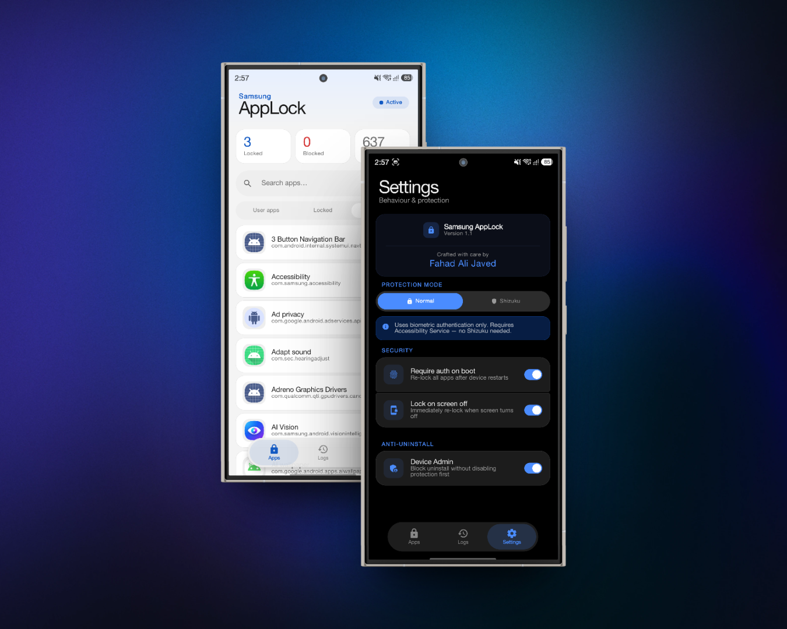

# 🔐 Samsung AppLock

  
  
  
  

  A native, biometric-protected app locker built specifically for Samsung devices. 
  Designed to look and feel like it shipped with One UI — because it should have.

  

---

## ⬇️ Download

👉 **[Get the latest APK from Releases](../../releases/latest)**

> **Requirements:**
> - Android 8.0 (Oreo) or higher
> - Samsung device recommended (One UI 6.0+)
> - Enable **Install from unknown sources** for your browser/file manager

---

## ✨ Features

- 🔒 **Biometric authentication** — fingerprint or PIN/pattern required to unlock protected apps
- 🛡️ **Dual protection modes** — Normal (Accessibility) and Shizuku (system-level)
- 📋 **Activity log** — full history of unlock attempts and blocked launches with timestamps
- 🔍 **App search & filtering** — find apps instantly across User, Locked, and System tabs
- 📊 **Stats dashboard** — live count of locked apps, blocked attempts, and total installed
- 🔐 **Device Admin protection** — prevents uninstall without disabling protection first
- 🔄 **Auto re-lock on screen off** — apps are secured the moment your screen turns off
- 🔑 **Require auth on boot** — biometric required every time the device restarts
- 🎨 **Pixel-perfect One UI 8.5 design** — feels completely native on Samsung devices
- 🌙 **Full dark mode support** — matches your system theme automatically
- ⚡ **Smooth scrolling** — no jank even with 600+ apps installed

---

## 🛡️ Protection Modes

### Normal Mode
Uses Android's **Accessibility Service** to monitor foreground apps and trigger biometric authentication when a locked app is launched.

- ✅ No root required
- ✅ No extra apps needed  
- ✅ Works on any Android device
- ⚠️ Can potentially be bypassed by force-stopping the accessibility service

### Shizuku Mode ⚡ *(Recommended)*
Uses **Shizuku** to run a privileged service at the system level (UID 0/1000) — the same access level that system apps have. Instead of just intercepting app launches, it controls the app at the package level directly.

- ✅ True system-level enforcement — significantly harder to bypass
- ✅ Controls apps at the package level, not just intercepts them
- ✅ Survives battery optimization and aggressive task killers
- ✅ More reliable on Samsung's heavily modified Android layer
- ⚠️ Requires [Shizuku] UID 1000 - System shell exploit
- ⚠️ Shizuku needs to be re-activated after reboot

> **Bottom line:** Normal mode is zero-setup and works great for most people. Shizuku mode is for those who want airtight, system-level protection that can't be easily circumvented.

---

## 🚀 Installation

1. Go to **[Releases](../../releases/latest)** and download the latest `SamAppLock.apk`
2. Open the APK on your device and tap **Install**
3. Open the app and authenticate with biometric
4. Grant **Accessibility Service** permission when prompted
5. Start locking apps!

### For Shizuku Mode (optional)
1. Install [Shizuku]
2. Activate Shizuku UID 1000 with shell exploit
3. In SamAppLock → Settings → switch to **Shizuku mode**
4. Grant the permission when Shizuku prompts you

---

## ⚙️ Permissions Explained

| Permission | Why it's needed |
|---|---|
| `PACKAGE_USAGE_STATS` | Detect which app is currently in the foreground |
| `BIND_ACCESSIBILITY_SERVICE` | Monitor and intercept app launches in Normal mode |
| `USE_BIOMETRIC` | Fingerprint / face / PIN authentication |
| `FOREGROUND_SERVICE` | Keep the protection service alive in the background |
| `QUERY_ALL_PACKAGES` | List all installed apps so you can choose which to lock |
| `RECEIVE_BOOT_COMPLETED` | Re-arm protection automatically after device restart |
| `BIND_DEVICE_ADMIN` | Prevent the app from being uninstalled without your permission |

> **Privacy note:** This app has no internet permission. Zero data leaves your device. Ever.

---

## ⚠️ Disclaimer

This app is provided as-is. It is not affiliated with or endorsed by Samsung Electronics. One UI is a trademark of Samsung Electronics Co., Ltd.

---

Built with ❤️ by <b>Fahad Ali Javed</b>

